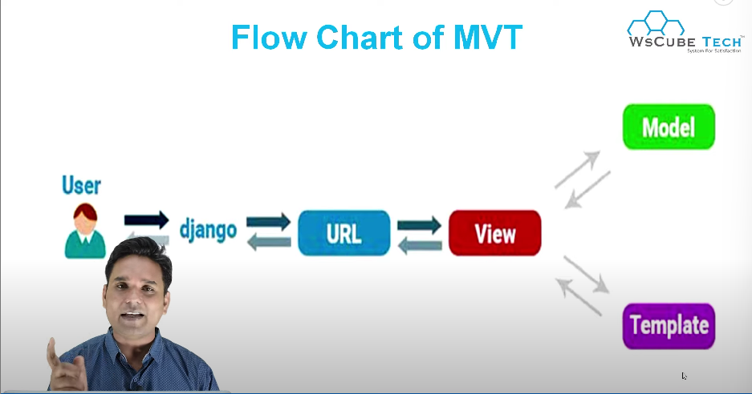

# What is Model View Template (MVT) 

- The MVT (Model View Template) is a software design pattern.
- It is a collection of three important components Model View and Template.
    - Model - Model is going to act as the interface of your data.
    - View - The view is the user interface 
    - Template - A template consists of static parts of the desired HTML output as some special syntax describing how dynamic content will be inserted.

- View is connected with both `Model` & `Template`

